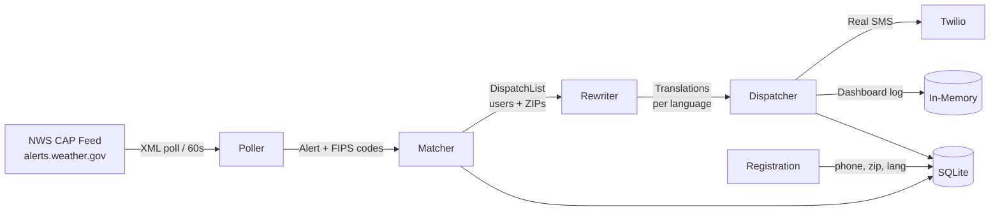

# AlertBridge

A multi-agent emergency alert distribution system that parses real-time NWS CAP/Atom feeds, geo-matches alerts to registered subscribers by county, rewrites them into plain-language SMS using the Claude API, and delivers them via Twilio — across 6 languages.

**[Live Demo →](https://alertbridge-production.up.railway.app)** &nbsp;|&nbsp; Built in 24 hours at a hackathon

---

## What It Does

- **Ingests real NWS data** — Polls the [National Weather Service CAP/Atom feed](https://alerts.weather.gov/cap/us.php?x=1) every 60 seconds for live emergency alerts (floods, hurricanes, wildfires, etc.)
- **Geo-matches by county** — Extracts FIPS county codes from CAP geocode fields and maps them to ZIP codes via a crosswalk covering **3,142 US counties and ~40,000 ZIP codes**
- **Rewrites with AI** — Uses the Claude API to compress verbose NWS alert text into ≤160-character plain-language SMS, per-language, with fallback chains
- **Delivers via Twilio** — Fans out to all registered subscribers in affected ZIPs with SQL-enforced deduplication; falls back to mock logging when Twilio is unconfigured

---

## Architecture



**Agent pipeline (single Node.js process, phase-ordered):**

| Agent | Role |
|---|---|
| `alert-poller` | Fetches and parses NWS CAP/Atom XML; deduplicates by alert ID |
| `geo-matcher` | Looks up FIPS→ZIP crosswalk; queries SQLite for subscribers in affected ZIPs |
| `ai-rewriter` | Calls Claude API to produce ≤160-char SMS; caches per (alertId, language) |
| `sms-dispatcher` | Fans out to subscribers with 5-concurrent limit; dedupes via `sent_alerts` table |
| `registration-handler` | Express webhook — 3-step SMS state machine (ZIP → language → confirm) |
| `dashboard` | Live observability UI with real-time SMS log, stats, and simulation trigger |

---

## Design Decisions

| Decision | Choice | Why |
|---|---|---|
| **Alert source** | NWS CAP/Atom XML feed (polled) | Real-time official data; no auth required; polling simpler than webhooks for a stateless poller |
| **Geo-routing** | FIPS→ZIP crosswalk JSON | CAP alerts use FIPS county codes natively; ZIP is what users know — a static crosswalk avoids a geocoding API call per alert |
| **AI translation** | Claude API (`claude-haiku-4-5-20251001`) | Handles nuanced emergency language better than rule-based translation; haiku is fast enough for real-time fan-out; falls back to Ollama for local dev |
| **SMS delivery** | Twilio Programmable SMS | Standard for programmable SMS; Twilio Sandbox lets trial accounts send to verified numbers without carrier approval |
| **Storage** | SQLite (`better-sqlite3`) | ACID `INSERT OR IGNORE` enforces dedup at the DB layer; no infrastructure overhead; survives process restarts |
| **Dedup strategy** | `UNIQUE(phone, alert_id)` in `sent_alerts` | Survives restarts (unlike in-memory sets); enforced by the database so application bugs can't double-send |
| **Concurrency** | 5-user batch limit in dispatcher | Respects Twilio rate limits and Claude API throughput; `Promise.all` within each batch for parallelism |
| **Dashboard** | Server-rendered HTML + 3s polling | No build step, no bundler; works in any browser; real-time feel without a WebSocket |

---

## Scale

- FIPS crosswalk: **3,142 US counties**, **~40,000 ZIP codes**
- Languages supported: **6** (English, Spanish, Chinese, Vietnamese, Tagalog, Korean)
- Simulation scenarios: **9** (flash flood, hurricane, earthquake, wildfire, tornado, drought, tsunami, landslide, volcanic)
- Alert deduplication: SQL-enforced, persists across restarts

---

## Local Setup

**Prerequisites:** Node.js 18+, a Twilio account (trial is fine), an Anthropic API key

```bash
git clone https://github.com/siddhjain-us/alertbridge.git
cd alertbridge
npm install
cp .env.example .env   # fill in your keys
mkdir -p db
npm start
```

Open **http://localhost:3000** — use the Simulate panel to trigger a full alert pipeline without waiting for a real NWS event.

**Seed demo subscribers** (6 users in ZIP 94102, one per language):

```bash
npm run seed:demo
```

### Environment Variables

See [`.env.example`](.env.example) for the full list. Key vars:

| Variable | Required | Description |
|---|---|---|
| `TWILIO_ACCOUNT_SID` | For real SMS | From console.twilio.com |
| `TWILIO_AUTH_TOKEN` | For real SMS | From console.twilio.com |
| `TWILIO_PHONE_NUMBER` | For real SMS | Your Twilio number (e.g. `+15551234567`) |
| `ANTHROPIC_API_KEY` | For AI translation | From console.anthropic.com — required on Railway |
| `OLLAMA_URL` | Local dev fallback | Defaults to `http://localhost:11434` |

If Twilio env vars are absent, the dispatcher logs mock SMS to console and the dashboard — useful for local demos without a Twilio account.

---

## API Reference

| Method | Path | Description |
|---|---|---|
| `GET` | `/` | Live dashboard (HTML) |
| `GET` | `/api/stats` | User counts + SMS sent count |
| `GET` | `/api/sms-log` | JSON array of delivered SMS entries |
| `GET` | `/api/subscribers` | Registered users (ZIP, language, masked phone) |
| `GET` | `/api/simulate-scenarios` | Available simulation scenario IDs |
| `POST` | `/simulate` | Trigger full pipeline: `{ "zip": "94102", "scenario": "flash_flood" }` |
| `POST` | `/sms` | Twilio webhook for SMS registration |
| `POST` | `/api/clear-data` | Reset demo data (SQLite + in-memory cache) |

Valid scenario IDs: `flash_flood`, `hurricane`, `earthquake`, `wildfire`, `tornado`, `drought`, `tsunami`, `landslide`, `volcanic`

---

## Project Layout

```
src/
  poller/         # NWS feed fetch, CAP XML parser, cron loop
  matcher/        # FIPS→ZIP crosswalk, subscriber lookup
  rewriter/       # Claude/Ollama translation, cache, fallback chains
  dispatcher/     # Twilio SMS fan-out, dedup, mock log
  registration/   # SMS registration state machine
  dashboard/      # Express UI, REST API, simulation scenarios
data/
  fips-to-zip.json  # County→ZIP crosswalk (3,142 counties)
db/               # SQLite (alertbridge.db gitignored)
index.ts          # Orchestrator — starts all agents in phase order
railway.toml      # Railway deployment config
```

---

## Resume Bullet Points

> Copy-paste ready for your resume:

- Built a 6-agent emergency alert distribution system (Node.js/TypeScript) that parses real-time NWS CAP/Atom XML feeds and geo-matches alerts to subscribers using a FIPS-to-ZIP crosswalk covering 3,142 US counties
- Designed an AI translation pipeline using the Claude API with multi-level caching, language-detection fallbacks, and ≤160-character truncation for SMS delivery across 6 languages (EN/ES/ZH/VI/TL/KO)
- Integrated Twilio Programmable SMS for alert delivery with SQL-enforced deduplication (`UNIQUE(phone, alert_id)`) to prevent duplicate alerts across process restarts
- Deployed on Railway with environment-driven configuration (Claude API on cloud, Ollama fallback for local dev); live dashboard with real-time observability via server-rendered HTML

---

## License

ISC
